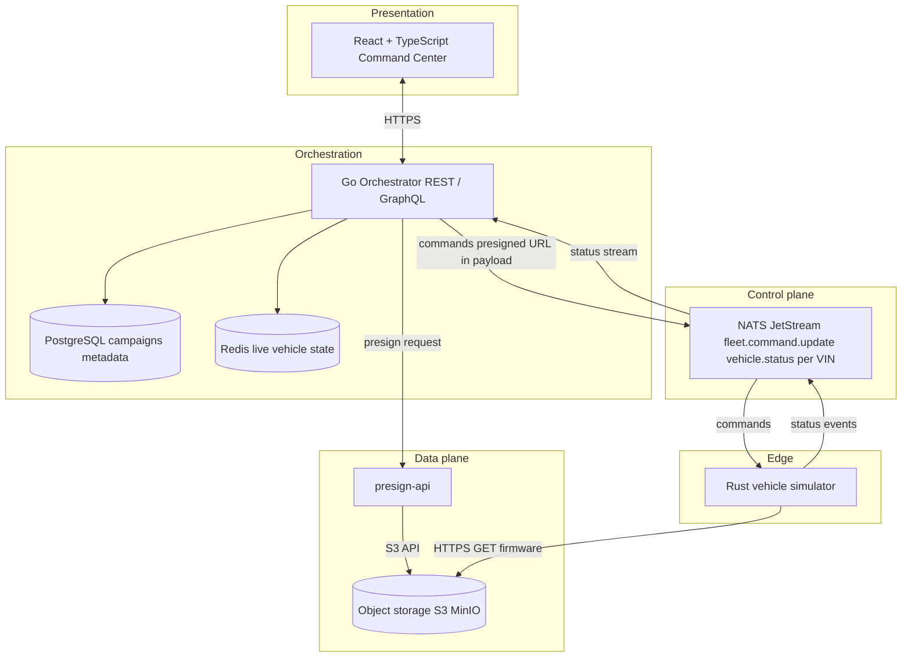

# Overdrive OTA Manager

Enterprise-style **fleet OTA orchestration** platform: control plane (NATS), data plane (S3-compatible object storage + presigned HTTPS downloads), Go orchestrator, and a React command center. Product intent and phased delivery live under `plan docs/` and `plan-docs/`.

[](https://vgandhi1.github.io/Overdrive-OTA-Manager/)
[](presentation.html)

📊 **[Live Presentation](https://vgandhi1.github.io/Overdrive-OTA-Manager/)** · [Static slides](presentation.html)

*(Pages: **Settings → Pages → Deploy from branch → `gh-pages` / (root)** — not `main`; run **Deploy GitHub Pages** workflow after push)*

## Architecture schematic

Split-plane design: **low-latency signaling** over NATS (small messages, including presigned URLs) and **large firmware binaries** over HTTPS directly to object storage. Based on `plan-docs/architecture.md`.



**Legend:** Solid arrows are the primary runtime data paths. **Today (Phase 1)** the repo runs **object storage** and **`presign-api`** (Compose / `k8s/`). **UI, orchestrator, NATS, Redis, Postgres, and Rust simulators** are planned in later phases; the diagram shows the end-state topology they plug into.

## Current execution status (Phase 1)

Implemented today:

- **Docker Compose** — MinIO (`firmware` bucket), init job, and **`presign-api`** (Go) issuing time-limited presigned GET URLs for object keys.
- **Kubernetes** — `k8s/` manifests for the same data-plane slice (namespace `overdrive-ota`).
- **Smoke helper** — `scripts/presign-smoke.sh`.

Later phases (NATS, Rust simulator, Go campaign orchestrator, React UI, chaos/idempotency) are described in `plan-docs/plan.md` and `plan-docs/architecture.md`.

### Prerequisites

- Docker Engine **24+** with Compose v2 (`docker compose`), **or**
- `kubectl` + a cluster with default storage only if you add PVCs later; current MinIO manifest uses `emptyDir` for frictionless apply.

### Run locally (recommended)

From the repository root:

```bash
docker compose up --build
```

Services:

| Service       | Purpose                         | Ports (host) |
|---------------|----------------------------------|----------------|
| `minio`       | S3-compatible firmware storage  | 9000 (API), 9001 (console) |
| `minio-init`  | Creates bucket `firmware`       | — |
| `presign-api` | Presigned download URLs         | 8080 |

Default credentials are **development only**. Change `MINIO_ROOT_*` and `PRESIGN_API_KEYS` before any shared or production-like environment.

### Presign API

- **Health:** `GET http://localhost:8080/healthz`
- **Metrics:** `GET http://localhost:8080/metrics` (Prometheus scrape target — `ota_active_campaigns`, `ota_vehicle_updates_total`, `ota_nats_processing_latency`)
- **Presign:** `POST http://localhost:8080/v1/presign`  
  - Header: `Authorization: Bearer <key>` **or** `X-API-Key: <key>`  
  - Body: `{"object_key":"path/to/file.bin"}` (strict key format; no path traversal)

Example:

```bash
curl -sS -X POST http://localhost:8080/v1/presign \
  -H "Content-Type: application/json" \
  -H "Authorization: Bearer dev-local-key" \
  -d '{"object_key":"firmware/v1/hello.bin"}'
```

Presigned URLs default to a **2 hour** TTL (`PRESIGN_TTL_SECONDS`, max 86400). With Compose, the URL host is typically `http://minio:9000`, which is correct for **other containers on the same network** (e.g. a future vehicle simulator). From the host OS, use MinIO on `localhost:9000` only if you align signing host with how clients reach MinIO.

### Kubernetes (`k8s/`)

Apply in order (after building and loading the `presign-api` image your cluster expects, e.g. `presign-api:latest` per `k8s/03-presign-api.yaml`):

```bash
kubectl apply -f k8s/00-namespace.yaml
kubectl apply -f k8s/01-minio.yaml
kubectl apply -f k8s/02-minio-job-init.yaml
kubectl apply -f k8s/03-presign-api.yaml
```

Edit Secrets in the manifests before anything beyond local dev.

---

## Reference: target Go orchestrator (`plan-docs/`)

The files `plan-docs/deployment.yaml` and `plan-docs/service.yaml` describe the **intended** Kubernetes shape for the **Go orchestrator** (Phase 3 / control plane API), not the current `presign-api`.

### `plan-docs/deployment.yaml` (orchestrator)

| Aspect | Reference intent |
|--------|-------------------|
| **Workload** | `Deployment` `overdrive-orchestrator`, label `app: overdrive-orchestrator` |
| **Scale** | `replicas: 3` for HA |
| **Container port** | **8080** (REST/GraphQL as designed) |
| **Env** | `NATS_URL` (e.g. `nats://nats-broker:4222`), `DB_HOST` (e.g. `postgres-db`) — extend with Redis, S3/presign base URL, etc. |
| **Resources** | Requests/limits set (example: 128–256 Mi RAM, 250–500m CPU) |
| **Probes** | `readinessProbe`: `GET /health/ready` on 8080; `livenessProbe`: `GET /health/live` on 8080 |

When you implement the orchestrator service, match this contract so platform tooling and the Service definition stay consistent. The Phase 1 **`presign-api`** currently exposes **`/healthz`** only; either add `/health/ready` and `/health/live` to presign (or a shared base image pattern), or keep presign separate and implement these paths **only** on the orchestrator Deployment.

### `plan-docs/service.yaml` (orchestrator)

| Aspect | Reference intent |
|--------|-------------------|
| **Name** | `overdrive-orchestrator-svc` |
| **Type** | `ClusterIP` (internal); use `LoadBalancer` or Ingress only if you intentionally expose the API |
| **Selector** | `app: overdrive-orchestrator` |
| **Ports** | Service **port 80** → `targetPort` **8080** (in-cluster callers use port 80 to reach the app on 8080) |

`k8s/03-presign-api.yaml` today exposes the app on Service port **8080** → container **8080** for simplicity. When you add the orchestrator alongside presign, follow `plan-docs/service.yaml` for the orchestrator Service so other components call a stable HTTP port (80) inside the cluster.

---

## Repository layout

| Path | Description |
|------|-------------|
| `presentation.html` | Static slide deck (GitHub Pages) |
| `docker-compose.yml` | Local Phase 1 stack |
| `services/presign-api/` | Go presign service source and `Dockerfile` |
| `k8s/` | Namespace, MinIO, bucket Job, presign Deployment/Service |
| `plan-docs/` | Mission, phases, architecture + K8s reference snippets |
| `plan-docs/` | Example K8s snippets (orchestrator Service + Deployment) |
| `scripts/presign-smoke.sh` | Optional API smoke test |

---

## Security notes

- Replace default MinIO and `PRESIGN_API_KEYS` values for non-local use.
- Do not commit real credentials; use Secrets and sealed secrets / external secret managers in Kubernetes.
- Presign requests accept only validated **`object_key`** values (no arbitrary URLs).

---

## Next steps (from `plan docs/plan.md`)

1. **Phase 2** — NATS JetStream; Rust vehicle simulator (subscribe, HTTPS download, publish states).
2. **Phase 3** — Go orchestrator aligned with `plan-docs/deployment.yaml` / `service.yaml` (campaigns, state machine, canary).
3. **Phase 4** — React + TypeScript command center and real-time updates.
4. **Phase 5** — Idempotent commands, chaos / retry validation.

For questions about topology and topics, see `plan-docs/architecture.md`.
