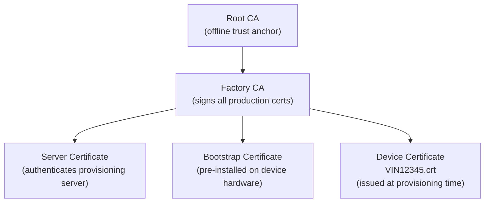
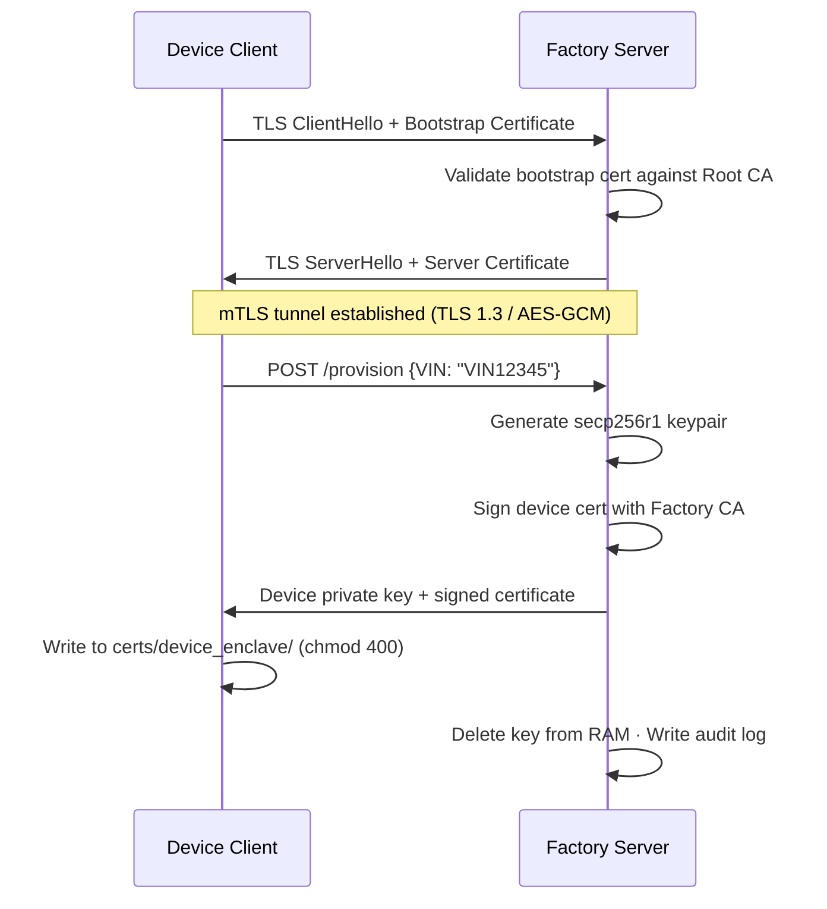

# Automotive Key Provisioner

A Python simulation of the factory-floor device provisioning pipeline used in connected vehicle manufacturing. Each vehicle receives a unique cryptographic identity — injected securely over **mutual TLS** — before leaving the production line. Implements the supply-chain security requirements of **UNECE WP.29/R155** and **ISO/SAE 21434**.

> Proof-of-concept for educational and portfolio purposes. Uses a local PKI in place of an HSM-backed production CA.

---

## PKI Trust Hierarchy



---

## Provisioning Flow



---

## Quick Start

**Prerequisites:** Python 3.10+

```bash
git clone https://github.com/vgandhi1/automotive-key-provisioner.git
cd automotive-key-provisioner
python3 -m venv .venv && source .venv/bin/activate
pip install -r requirements.txt
```

```bash
# 1. Generate full PKI chain (run once after clone — keys are excluded from git)
python3 ca/scripts/setup_ca.py

# 2. Start the mTLS server
python3 -m uvicorn server.factory_server:app --host 0.0.0.0 --port 8443 \
  --ssl-keyfile certs/server/server.key --ssl-certfile certs/server/server.crt \
  --ssl-cert-reqs 2 --ssl-ca-certs ca/root_ca/ca.crt

# 3. Provision a device (new terminal)
python3 -m client.device_client VIN12345 --url https://localhost:8443
# → certs/device_enclave/VIN12345.key + VIN12345.crt written (chmod 400)
```

### Docker

```bash
docker build -f server/Dockerfile -t automotive-key-provisioner .
docker run -p 8443:8443 -v provisioning_audit_data:/app/server automotive-key-provisioner
```

---

## Tests

```bash
PYTHONPATH=. python3 -m pytest tests/ -v
```

| Test | Scenario |
|---|---|
| `test_crypto.py` | Certificate chain validates: Root → Factory CA → device / bootstrap |
| `test_mtls_negative.py` | Connection without a client cert is rejected |
| `test_injection.py` | Injected key signs a message that verifies against the issued device cert |

---

## Security Model

| Threat | Mitigation |
|---|---|
| Network sniffing on factory LAN | Keys transmitted only inside mutually authenticated TLS 1.3 tunnel |
| Rogue device on production network | Server rejects any connection without a valid Factory CA-signed bootstrap cert |
| Insider key exfiltration | Server zeroes private key from RAM after delivery; all issuances logged to audit DB |

**Stack:** Python · FastAPI · uvicorn · cryptography · SQLite audit log · Docker

---

## Further Reading

- [`ARCHITECTURE_PROVISIONING.md`](ARCHITECTURE_PROVISIONING.md) — PKI design and cryptographic data flow
- [`TECHNICAL_STACK.md`](TECHNICAL_STACK.md) — library and language choices
- UNECE WP.29/R155 · ISO/SAE 21434
