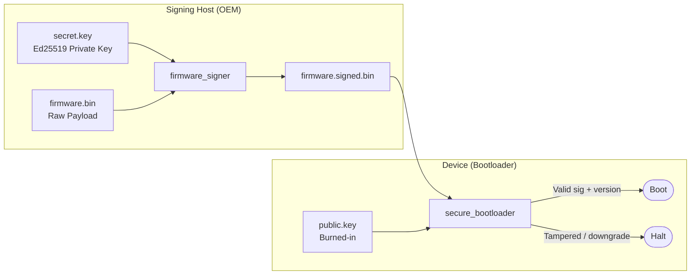

# OTA Firmware Verifier

A Rust simulation of the secure boot and OTA firmware verification pipeline used in automotive ECUs. Models cryptographic signing, bootloader verification, and anti-rollback enforcement — the core mechanisms mandated by **UNECE WP.29/R156** and **ISO/SAE 21434**.

> Proof-of-concept for educational and portfolio purposes.

[](https://vgandhi1.github.io/OTA-firmware-verifier/)
[](presentation.html)

📊 **[Live Presentation](https://vgandhi1.github.io/OTA-firmware-verifier/)** · [Static slides](presentation.html) *(Pages: **Settings → Pages → Source: GitHub Actions**, then run **Deploy GitHub Pages** workflow)*

---

## How It Works



### Signed image format

```
0x00  4B   Magic ("SBOT")
0x04  4B   Version (u32 LE)        ← anti-rollback counter
0x08  4B   Payload size (u32 LE)
0x0C  64B  Ed25519 signature over SHA-256(payload)
0x4C  …    Raw firmware payload
```

---

## Quick Start

**Prerequisites:** Rust stable (≥ 1.60) — install via [rustup](https://rustup.rs)

```bash
git clone https://github.com/vgandhi1/ota-firmware-verifier.git
cd ota-firmware-verifier
cargo build --workspace
```

```bash
# 1. Generate keypair (once)
cargo run -p firmware_signer -- keygen --secret secret.key --public public.key

# 2. Create a test payload and sign it
dd if=/dev/urandom of=firmware.bin bs=256 count=1
cargo run -p firmware_signer -- sign --payload firmware.bin --version 1 --key secret.key --output firmware.signed.bin

# 3. Verify and boot
cargo run -p secure_bootloader -- --image firmware.signed.bin --public-key public.key
# → [SUCCESS] Booting image...

# 4. Test anti-rollback (stored version > image version)
echo "2" > stored_version.txt
cargo run -p secure_bootloader -- --image firmware.signed.bin --public-key public.key
# → [FATAL] Version downgrade rejected. Halting.
```

> `secret.key` is excluded by `.gitignore` — never commit it.

---

## Tests

```bash
cargo test --workspace
```

| Test | Scenario |
|---|---|
| `golden_path` | Valid image + matching key → boots |
| `tamper` | One flipped bit in payload → rejected |
| `key_mismatch` | Signed with key A, verified with key B → rejected |
| `downgrade` | Stored version 2, image version 1 → rejected |

---

## Security Model

| Threat | Mitigation |
|---|---|
| Malicious USB firmware flash | Attacker cannot forge a signature without the OEM private key |
| OTA tampering in transit | SHA-256 hash change invalidates the Ed25519 signature |
| Reflashing an older signed image | Monotonic version counter rejects version downgrades |

**Stack:** Rust · `ed25519-dalek` · `sha2` · Cargo workspace

---

## Further Reading

- [`architecture.md`](architecture.md) — binary format and cryptographic design
- [`TECH_STACK.md`](TECH_STACK.md) — library and language choices
- UNECE WP.29/R156 · ISO/SAE 21434
