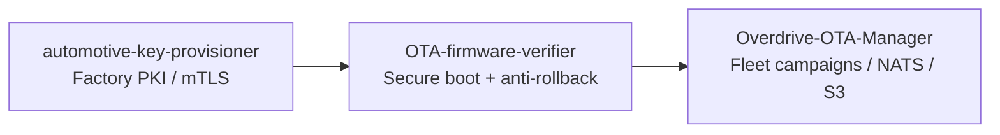

<div align="center">

# Automotive OTA Security Portfolio

### Connected-vehicle security — factory PKI → secure boot → fleet OTA

[](automotive-key-provisioner/)
[](OTA-firmware-verifier/)
[](Overdrive-OTA-Manager/)

<br />

*Consolidated meta-repo (Phase 2, 2026-06-28). Tracking:* [`CONSOLIDATION-CHANGELOG.md`](CONSOLIDATION-CHANGELOG.md)

</div>

---

Umbrella repo for **WP.29 / ISO 21434** portfolio demos: device identity at the factory, cryptographic verification before flash, and fleet-scale OTA orchestration. Each subfolder was formerly an independent GitHub repository; histories are preserved via `git subtree` import.

## Security pipeline



| Phase | Standard | Project | Stack |
|-------|----------|---------|-------|
| **Identity** | UNECE R155 | [`automotive-key-provisioner/`](automotive-key-provisioner/) | Python PKI sim |
| **Integrity** | UNECE R156 | [`OTA-firmware-verifier/`](OTA-firmware-verifier/) | Rust secure-boot sim |
| **Orchestration** | Fleet OTA | [`Overdrive-OTA-Manager/`](Overdrive-OTA-Manager/) | Go + React + NATS |

## Live presentations

| Project | New meta-repo Pages path | Legacy Pages (archived repo, static) |
|---------|--------------------------|--------------------------------------|
| Key provisioner | […/automotive-ota-security/automotive-key-provisioner/](https://vgandhi1.github.io/automotive-ota-security/automotive-key-provisioner/) | [automotive-key-provisioner](https://vgandhi1.github.io/automotive-key-provisioner/) |
| Firmware verifier | […/OTA-firmware-verifier/](https://vgandhi1.github.io/automotive-ota-security/OTA-firmware-verifier/) | [OTA-firmware-verifier](https://vgandhi1.github.io/OTA-firmware-verifier/) |
| OTA Manager | […/Overdrive-OTA-Manager/](https://vgandhi1.github.io/automotive-ota-security/Overdrive-OTA-Manager/) | [Overdrive-OTA-Manager](https://vgandhi1.github.io/Overdrive-OTA-Manager/) |

Run **Deploy GitHub Pages** workflow after changing any `presentation.html`. Enable Pages: **Settings → Pages → Deploy from branch → `gh-pages` / (root)**.

## Former standalone repos (archived)

| Archived remote | Subfolder here |
|-----------------|----------------|
| `vgandhi1/automotive-key-provisioner` | `automotive-key-provisioner/` |
| `vgandhi1/OTA-firmware-verifier` | `OTA-firmware-verifier/` |
| `vgandhi1/Overdrive-OTA-Manager` | `Overdrive-OTA-Manager/` |

`.git` backup before fold: `/tmp/automotive-ota-gitdirs-20260628.tgz`

## Portfolio docs

| Document | Purpose |
|----------|---------|
| [`portfolio/plan.md`](portfolio/plan.md) | Cross-project status |
| [`CONSOLIDATION-CHANGELOG.md`](CONSOLIDATION-CHANGELOG.md) | Full fold audit trail |
| [`../governance/Guardrails/`](../governance/Guardrails/) | Canonical AI guardrails (SSOT) |

## Clone

```bash
git clone https://github.com/vgandhi1/automotive-ota-security.git
cd automotive-ota-security/Overdrive-OTA-Manager   # or any sub-project
```

Each subfolder README remains the quickstart for that demo.
